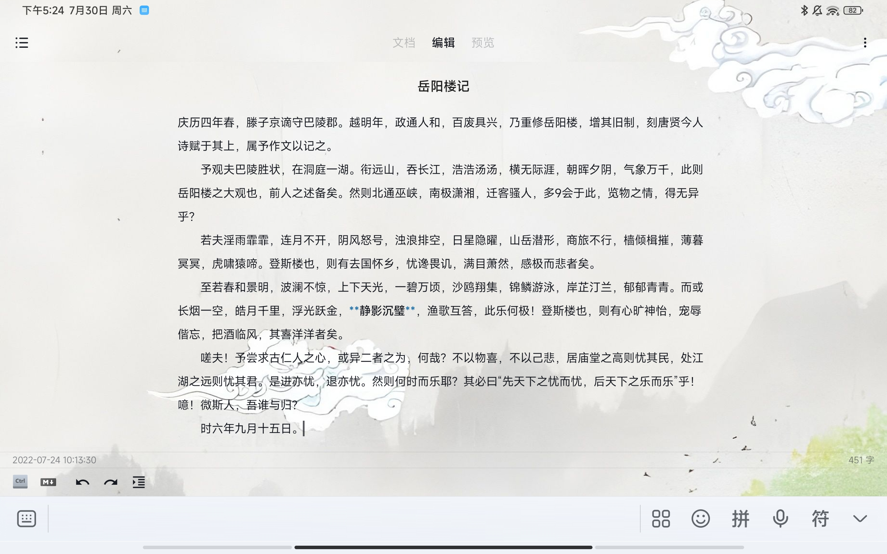
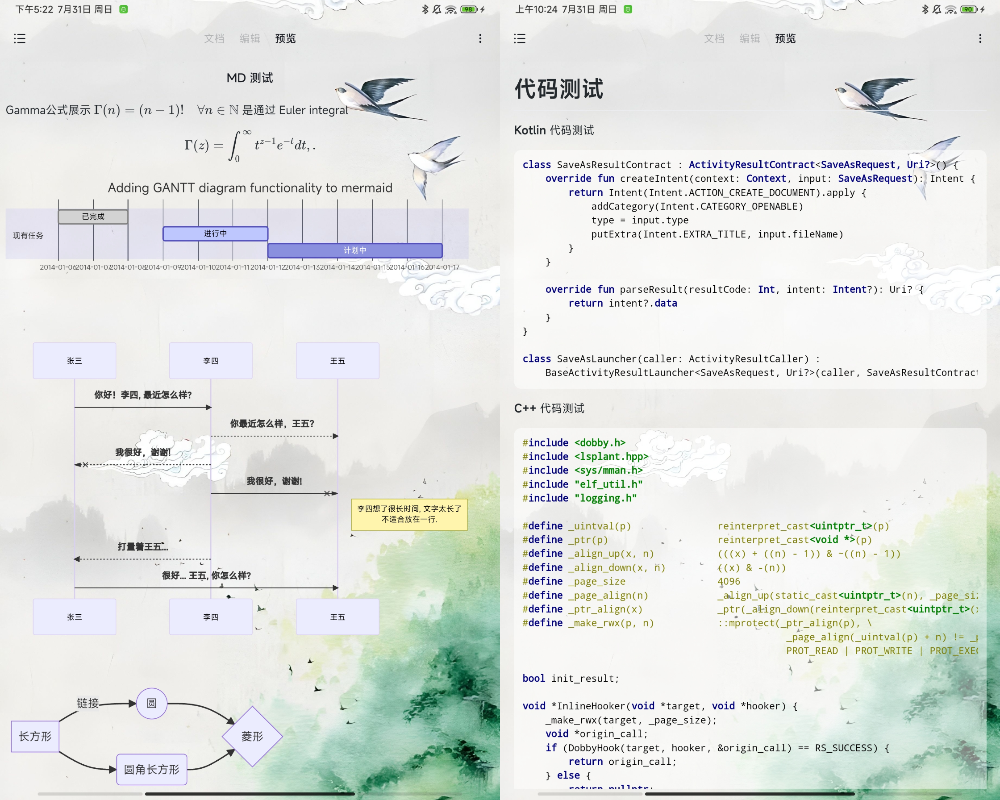

# 椒盐笔记

  
  
椒盐笔记 / Salt Note
 
<a href="http://moriafly.xyz/HiMoriafly/salt-note/" target="_blank">访问官网：http://moriafly.xyz/HiMoriafly/salt-note/</a>
 
一款**操作进化**的**纯文本** + **Markdown** 的，支持**无限文件夹嵌套**的**本地** + **WebDAV** 的 **Android** 平台笔记软件。

## 软件简介和开发目的

- **重视数据安全**
椒盐笔记采取了软件内数据库保存、本地指定文件夹备份、WebDAV 备份。

- **喜欢轻量写作**
椒盐笔记追求稳定性和流畅性，使得软件很适合快速记录同时也适合文章创造。

- **更方便的文章管理**
觉得单文件夹管理、不支持随意拖动排序也不方便？椒盐笔记支持**无限嵌套的多层级文件夹功能**、**随意拖动排序**和**随意多选**，如何摆放随你心意。

## 软件界面

## 操作进化

被各种页面跳转，编辑层级搞昏了？椒盐笔记主要使用界面都为**一级界面**，中间为编辑界面，左滑打开文档界面，可以浏览添加文章。而右滑为预览界面，可以预览渲染出的标记格式。

- **无限嵌套的多层级文件夹功能**
软件设计了多层级文件夹用来管理文章，没有使用多个单文件或者使用标签，它就像你使用文件管理器那样方便，让用户随意调整文章位置。

- **随意拖动排序**
受够了只有置顶功能的笔记软件了？本软件支持随意拖拽排序并记录它，无论文章、文件夹都可以拖动排序。

- **随意多选**
支持同时多选同一级文件夹下的子文件夹和文章，并将它们移动到其他文件夹。

- **快捷预览 Markdown**
滑动即可实时预览 Markdown 渲染，并支持双向滚动保持一致，方便进行文本调整。

## 优秀的 Markdown 编辑

- 支持 **Markdown** 标记文本。
- 支持多种语法的标记**高亮**
- 工具栏快捷 Markdown 输入

## 强大的 Markdown 渲染

支持几乎所有的 Markdown 元素渲染，包括**高亮代码**、 **Katex 数学公式**、**甘特图**等等。

## 静心创作

- **不打扰用户**
不弹窗更新、不发送任何干扰用户的通知。

- **个性化**
尽量首先为用户做选择并尽力提供可供用户选择的功能。

## 属于你的文件

椒盐笔记使用 Android 存储访问框架保存，更现代的文件保存方式。

- 支持导出**纯文本（.txt）**。
- 支持导出**Markdown 标记文本（.md）**。
- 支持导出**HTML 文本（.html）**。

## 自然语言审查功能

- 内置 **8W+** 的英文词库和基本的中文拼写检测。

- 提供了长文本中英文混合的**纠正功能**。

## 细节体验

- 支持**呼吸光标**，淡入淡出效果优秀。
- 优化的界面**动画**。
- **实时**字数统计。
- 支持**自动首行缩进**功能。
- 支持**撤销**、**重做**功能。
- 支持**单词联想输入**（适配 Android 原生等）。
- 适配 Android 10+ 深色模式，支持设定**跟随系统**、**浅色模式**、**深色模式**。

## 文章保护机制

- 支持文章发生改变后立刻**自动保存**。
- 提供**回收站功能**，避免误删除文章。

## 软件定价（暂未发布）

- **诚信付款机制**
椒盐笔记采取和椒盐音乐一样的定价策略，但价格可能会比椒盐音乐略高，但太一些同类产品中会是合适的价格。

- **可信赖的开发团队**
软件还是初期阶段，后续会逐步丰富功能，如椒盐音乐一样，经过一年多的发展，它现在已经发展到月活 10 万级别的软件。

## 技术支持

- **作者在线**
关注 QQ 频道**不要糖醋放椒盐**（可以在 QQ 频道中搜索），向作者提交建议和反馈，和大家一起讨论。

## 软件发布

已在 QQ 频道发布反馈版。